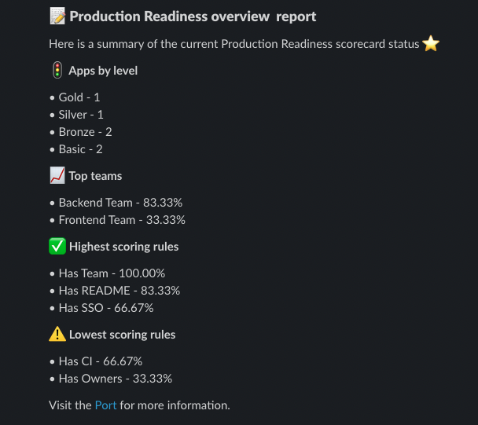
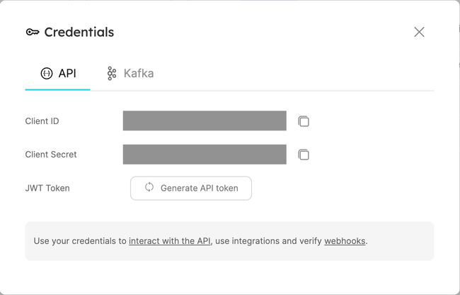
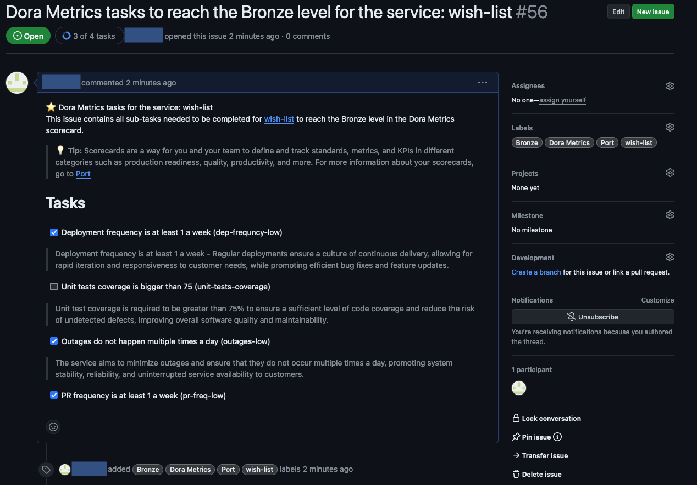

<picture>
  <source media="(prefers-color-scheme: dark)" srcset="https://port-graphical-assets.s3.eu-west-1.amazonaws.com/Logo+Typo+%2B+Logo+Symbol+-+white.png">
  <source media="(prefers-color-scheme: light)" srcset="https://port-graphical-assets.s3.eu-west-1.amazonaws.com/Logo+Typo+%2B+Logo+Symbol.svg">
  
</picture>

# Port Initiatives Sender GitHub Action

[](https://join.slack.com/t/port-community/shared_invite/zt-1x1iys4cn-oihCQp_ropEdIUIcKESImA)

Port is an open internal developer portal. The portal contains valuable data about standards and compliance (in the form of scorecards or initiatives) about software catalog entities, such as the production readiness (scorecard) of a microservice (an entity).

This action will allow you to automatically send reports and reminders with regard to initiatives or scorecards, letting managers and developers know what standards need to be met that are relevant to them.



## Pre-requisites

### Port

Find your Port credentials  
To find your Port API credentials go to Port, hover on the 3 dots button at the top right corner, select Credentials and then you will be able to view and copy your `CLIENT_ID` and `CLIENT_SECRET`:



### Slack

Setting up a slack webhook  
Head to your [Slack apps](https://api.slack.com/apps) page and create a new app (or select one of your existing apps). Then, go to the Incoming Webhooks page and create a new webhook, specifying the target channel on your server where messages that are sent to the slack webhook will be transferred.

Copy the webhook URL, you will use it soon to set up your GitHub action.

## Send Scorecard Report

Action to send a scorecard report to a Slack channel about the current state and progress in a scorecard.

### Output example

 

### Usage

| Input                | Description                                                                                              | Required | Default |
|----------------------|----------------------------------------------------------------------------------------------------------|----------|---------|
| `port_client_id`     | Port Client ID                                                                                           | true     |         |
| `port_client_secret` | Port Client Secret                                                                                       | true     |         |
| `port_region`        | Port Region to use, if not provided will use the default region of Port                        | false    | eu        |
| `slack_webhook_url`  | Slack Webhook URL                                                                                        | true     |         |
| `blueprint`          | Blueprint identifier                                                                                     | true     |         |
| `scorecard`          | Scorecard identifier                                                                                     | true     |         |
| `operation_kind`     | Message kind to send, to send Scorecard Report, pass - `scorecard_report`                                | true     |         |
| `filter_rule`        | The [rule filter](https://docs.getport.io/search-and-query/#rules) to apply on the data queried from Port | false    |         |

This action will send a scorecard report to a Slack channel about the current state and progress in a scorecard.

You can modify the schedule to run the report on a daily/weekly/monthly basis. For more information about scheduling, refer to the [GitHub Actions documentation](https://docs.github.com/en/actions/using-workflows/events-that-trigger-workflows#schedule).


```yaml
name: Scheduled Scorecards Report

on:
  schedule:
    ## run every day at 9am
    - cron: '0 9 * * *'
  workflow_dispatch:

jobs:
    generate-scorecard-report:
        runs-on: ubuntu-latest
        steps:
            - name: Generate Scorecard Report
              uses: port-labs/port-sender@v0.2.4
              with:
                operation_kind: scorecard_report
                port_client_id: ${{ secrets.PORT_CLIENT_ID }}
                port_client_secret: ${{ secrets.PORT_CLIENT_SECRET }}
                slack_webhook_url: ${{ secrets.SLACK_WEBHOOK_URL }}
                blueprint: app
                scorecard: productionReadiness
                target_kind: slack
```

## Send Scorecard Reminder

A call to action to remind the team that some of their services didn't reach Gold level for specific scorecard.

### Output example

 

### Usage

| Input                | Description                                                                                               | Required | Default |
|----------------------|-----------------------------------------------------------------------------------------------------------|----------|---------|
| `port_client_id`     | Port Client ID                                                                                            | true     |         |
| `port_client_secret` | Port Client Secret                                                                                        | true     |         |
| `port_region`        | Port Region to use, if not provided will use the default region of Port                                   | false    | eu        |
| `slack_webhook_url`  | Slack Webhook URL                                                                                         | true     |         |
| `blueprint`          | Blueprint identifier                                                                                      | true     |         |
| `scorecard`          | Scorecard identifier                                                                                      | true     |         |
| `operation_kind`     | Opetation kind to perform, to send Scorecard Reminder, pass - `scorecard_reminder`                        | true     |         |
| `filter_rule`        | The [rule filter](https://docs.getport.io/search-and-query/#rules) to apply on the data queried from Port | false    |         |

This example will send a scheduled reminder to a Slack channel about all the services that didn't reach the Gold level in the `productionReadiness` scorecard for the Backend Team.

You can modify the schedule to run the reminder on a daily/weekly/monthly basis. For more information about scheduling, refer to the [GitHub Actions documentation](https://docs.github.com/en/actions/using-workflows/events-that-trigger-workflows#schedule).
You can also modify the filter rule to filter the services, ideally you would want to filter by team, so that each team will get a reminder about their services.

```yaml
name: Generate Scorecards Reminders

on:
  schedule:
    ## run every day at 9am
    - cron: '0 9 * * *'
  workflow_dispatch:

jobs:
    generate-scorecards-reminders:
        runs-on: ubuntu-latest
        steps:
            - name: Generate Scorecards Reminders
              uses: port-labs/port-sender@v0.2.4
              with:
                operation_kind: scorecard_reminder
                port_client_id: ${{ secrets.PORT_CLIENT_ID }}
                port_client_secret: ${{ secrets.PORT_CLIENT_SECRET }}
                slack_webhook_url: ${{ secrets.SLACK_WEBHOOK_URL }}
                blueprint: app
                scorecard: productionReadiness
                filter_rule: '{"property": "$team","operator": "containsAny","value": ["Backend Team"]}'
                target_kind: slack
```


## Manage scorecards with Jira issues 
A call to action to sync Jira issues (create/reopen/resolve) with scorecards and rules.

For every scorecard level that is not completed, a Jira task will be created and Subtasks for the level rules.

### Output example

Generated Scorecard task for the bronze level:
 

Generated subtasks for the task:


### Usage

| Input                        | Description                                                                                                                                                                                              | Required | Default |
|------------------------------|----------------------------------------------------------------------------------------------------------------------------------------------------------------------------------------------------------|----------|---------|
| `port_client_id`             | Port Client ID                                                                                                                                                                                           | true     |         |
| `port_client_secret`         | Port Client Secret                                                                                                                                                                                       | true     |         |
| `port_region`                | Port Region to use, if not provided will use the default region of Port                                                                                                                                  | false    | eu        |
| `slack_webhook_url`          | Slack Webhook URL                                                                                                                                                                                        | true     |         |
| `blueprint`                  | Blueprint identifier                                                                                                                                                                                     | true     |         |
| `scorecard`                  | Scorecard identifier                                                                                                                                                                                     | true     |         |
| `opeation_kind`              | Message kind to send, to send Scorecard Reminder, pass - `scorecard_reminder`                                                                                                                            | true     |         |
| `filter_rule`                | The [rule filter](https://docs.getport.io/search-and-query/#rules) to apply on the data queried from Port                                                                                                | false    |         |
| `jira_project_id`            | The [project id](https://confluence.atlassian.com/jirakb/how-to-get-project-id-from-the-jira-user-interface-827341414.html) in Jira for tasks updating                                                   | true     |         |
| `jira_api_endpoint`          | The URL of your Jira organization                                                                                                                                                                        | true     |         |
| `jira_token`                 | The [Jira API token ](https://support.atlassian.com/atlassian-account/docs/manage-api-tokens-for-your-atlassian-account/)for using Jira's REST API.                                                      | true     |         |
| `jira_email`                 | The Jira email of the user account for using Jira's REST API.                                                                                                                                            | true     |         |
| `jira_resolve_transition_id` | The Jira [transition](https://support.atlassian.com/jira-software-cloud/docs/transition-an-issue/) ID used for resolving issues. If not inserted will use the default transition for the "Done" status.  | false    |         |
| `jira_reopen_transition_id`  | The Jira [transition](https://support.atlassian.com/jira-software-cloud/docs/transition-an-issue/) ID used for resolving issues. If not inserted will use the default transition for the "To Do" status. | false    |         |

This example will create a Jira task for every service in every level that are not completed in the `productionReadiness` scorecard for the Backend Team.
For every rule in the scorecard that is not completed, a subtask under the relevant task in Jira will be created.
Once the scorecard is completed, the tasks and subtasks will be resolved (passed to Done status).

You can modify the schedule to run the reminder on a daily/weekly/monthly basis. For more information about scheduling, refer to the [GitHub Actions documentation](https://docs.github.com/en/actions/using-workflows/events-that-trigger-workflows#schedule).

You can also modify the filter rule to filter the services, ideally you would want to filter by team, so that each team will have relevant tasks about their services.

```yaml
name: Sync Jira Issues with Scorecard Initiatives

on:
  schedule:
    ## run every day at 9am
    - cron: '0 9 * * *'
  workflow_dispatch:

jobs:
    sync-jira-issues:
        runs-on: ubuntu-latest
        steps:
            - name: Sync Jira Issues
              uses: port-labs/port-sender@v0.2.4
              with:
                operation_kind: ticket_handler
                port_client_id: ${{ secrets.PORT_CLIENT_ID }}
                port_client_secret: ${{ secrets.PORT_CLIENT_SECRET }}
                blueprint: app
                scorecard: productionReadiness
                filter_rule: '{"property": "$team","operator": "containsAny","value": ["Backend Team"]}'
                jira_api_endpoint: https://example.atlassian.net
                jira_email: matar@getport.io
                jira_project_id: EXAMPLE
                jira_token: ${{ secrets.JIRA_TOKEN }}

                target_kind: jira

```

You can find more examples in the [examples folder](docs/examples/)


## Manage scorecards with Github issues 

A call to action to sync Github issues (create/reopen/close) with scorecards and rules.

For every scorecard level that is not completed in an entity, a Github Issue will be created and a task list will be created for the level rules (both complete and incomplete).

### Output example

Generated Scorecard issue for the bronze level:
 


### Usage

| Input                        | Description                                                                                                                                                                                              | Required | Default |
|------------------------------|----------------------------------------------------------------------------------------------------------------------------------------------------------------------------------------------------------|----------|---------|
| `port_client_id`             | Port Client ID                                                                                                                                                                                           | true     |         |
| `port_client_secret`         | Port Client Secret                                                                                                                                                                                       | true     |         |
| `port_region`                | Port Region to use, if not provided will use the default region of Port                                                                                                                                  | false    | eu        |
| `blueprint`                  | Blueprint identifier                                                                                                                                                                                     | true     |         |
| `scorecard`                  | Scorecard identifier                                                                                                                                                                                     | true     |         |
| `opeation_kind`              | What operation should the sender do, leave at - `issue_handler`                                                                                                                            | true     |         |
| `target_kind`                | leave at - `github`                                                                                                                            | true     |         |
| `filter_rule`                | The [rule filter](https://docs.getport.io/search-and-query/#rules) to apply on the data queried from Port                                                                                                | false    |         |
| `github_api_url`          | Github API URL. We recommend setting this to Github's `github.api_url` [context variable](https://docs.github.com/en/actions/learn-github-actions/variables#using-contexts-to-access-variable-values)   URL. Using GitHub Cloud, you should use - `https://api.github.com`                                                                                                                                                                                        | true     |         |
| `github_repository`            | The Github Repository. We recommend setting this to Github's `github.repository` [context variable](https://docs.github.com/en/actions/learn-github-actions/variables#using-contexts-to-access-variable-values)                                                   | true     |         |
| `github_token`          | The Github's Token used for create/get/update operations on issues. We recommend setting this to Github's `github.token` [context variable](https://docs.github.com/en/actions/learn-github-actions/variables#using-contexts-to-access-variable-values), and granting it default `issues: write` [permissions](https://docs.github.com/en/actions/using-jobs/assigning-permissions-to-jobs)                                                                                                                                                                           | true     |         |

This example will create a Github issue for every service in every level that are not completed in the `productionReadiness` scorecard for the Backend Team.
For each scorecard level that an entity fails to complete, a GitHub Issue will be generated. This issue will include a task list covering all the level's rules, both completed and incomplete.
Once the scorecard is completed, the issues and tasks in the task list will be resolved (the issue state will change to `closed`).  

You can modify the schedule to run the reminder on a daily/weekly/monthly basis. For more information about scheduling, refer to the [GitHub Actions documentation](https://docs.github.com/en/actions/using-workflows/events-that-trigger-workflows#schedule).

You can also modify the filter rule to filter the services, ideally you would want to filter by team, so that each team will have relevant issues about their services.

```yaml
name: Sync Github Issues with Scorecard Initiatives

on:
  schedule:
    ## run every day at 9am
    - cron: '0 9 * * *'
  workflow_dispatch:

jobs:
    sync-github-issues:
        permissions:
          issues: write
        runs-on: ubuntu-latest
        steps:
            - name: Sync Github Issues
              uses: port-labs/port-sender@v0.2.6
              with:
                operation_kind: issue_handler
                port_client_id: ${{ secrets.PORT_CLIENT_ID }}
                port_client_secret: ${{ secrets.PORT_CLIENT_SECRET }}
                blueprint: app
                scorecard: productionReadiness
                filter_rule: '{"property": "$team","operator": "containsAny","value": ["Backend Team"]}'
                github_api_url: ${{ github.api_url }}
                github_token: ${{ github.token }}
                github_repository: ${{ github.repository }}
                target_kind: github

```

You can find more examples in the [examples folder](docs/examples/)
